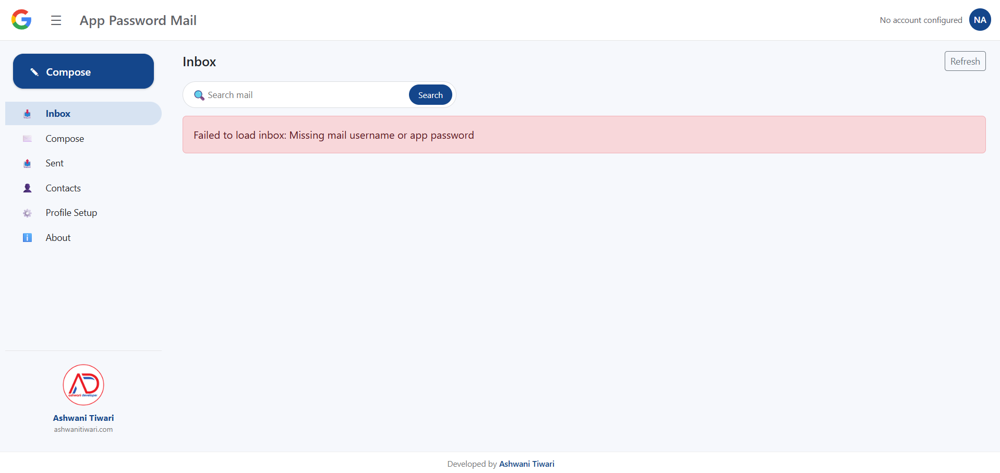
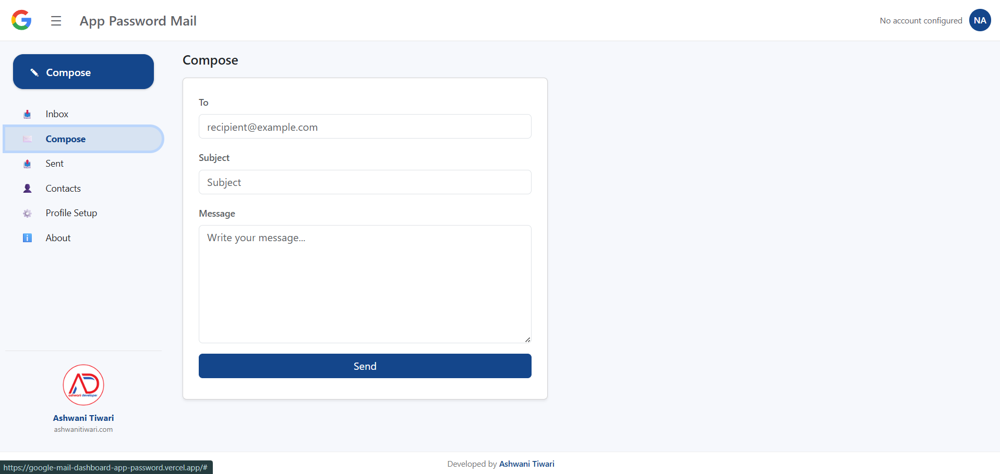
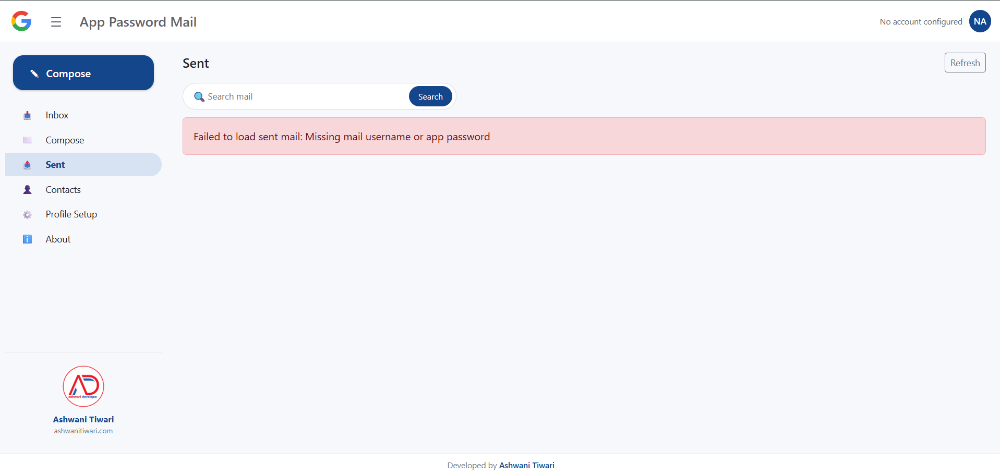
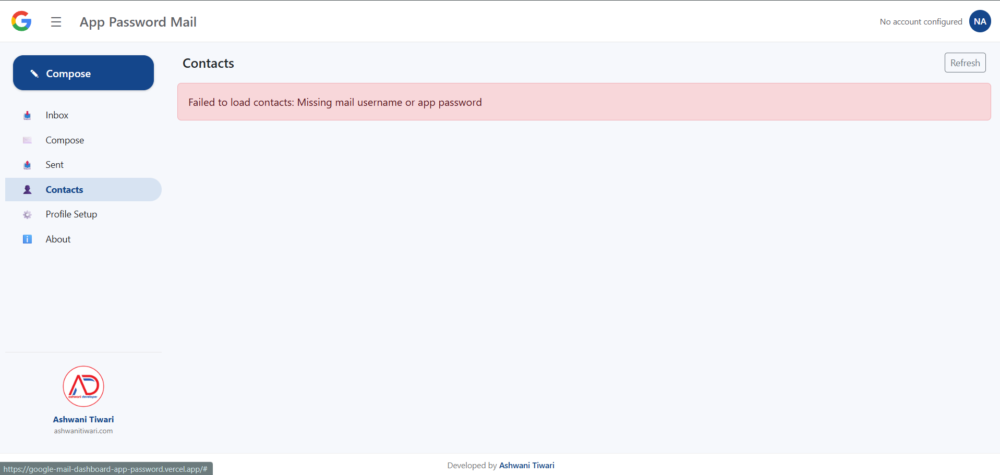
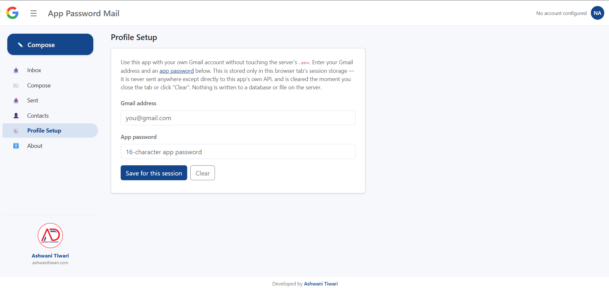
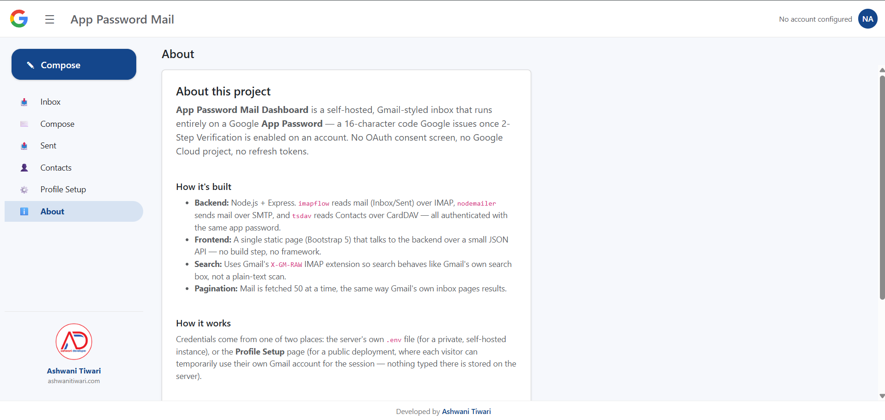
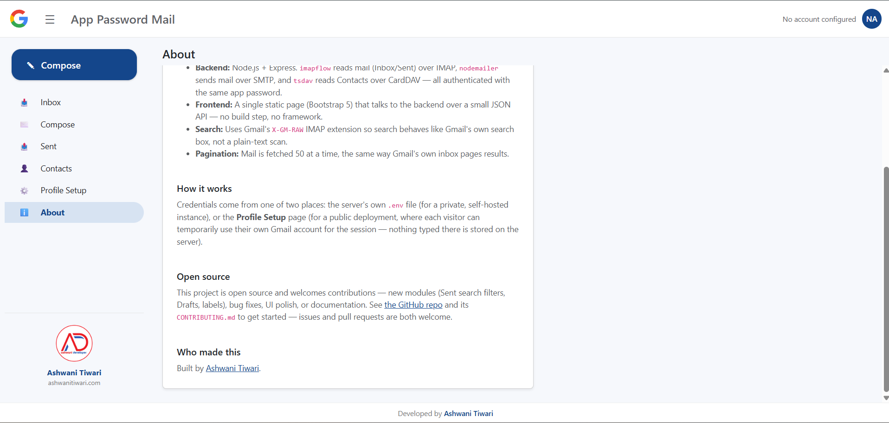

# App Password Mail Dashboard: No-OAuth Webmail Client

A lightweight, Gmail-styled open-source webmail dashboard — featuring Inbox, Sent, Compose, and Contacts — powered entirely by a **Google App Password** over IMAP, SMTP, and CardDAV. 

Skip the complex OAuth setup, Google Cloud Console projects, and API keys. Just generate an app password, run the Node.js application, and you're done.


Built by [Ashwani Tiwari](https://ashwanitiwari.com). Open source — contributions welcome, see [CONTRIBUTING.md](CONTRIBUTING.md).

---

## 📸 Dashboard Screenshots



### Main Dashboard / Inbox


### Compose Mail


### Sent Folder


### Contacts Integration


### Profile Setup (Bring Your Own Account)


### Who Made This About



---

## 🚀 Key Features & Capabilities

This Node.js and Express-powered dashboard uses a single Google **App Password** (a 16-character code generated when 2FA is enabled) to authenticate over standard mail protocols. No refresh tokens to manage, no consent screens.

| Feature | Status | Protocol | Description |
|---|---|---|---|
| **Inbox** | ✅ Working | IMAP | 50-per-page, full HTML body rendering, attachment support. |
| **Sent Folder** | ✅ Working | IMAP | 50-per-page pagination for outgoing mail. |
| **Search** | ✅ Working | IMAP (`X-GM-RAW`) | Advanced Gmail-style search across Inbox and Sent folders. |
| **Compose & Send** | ✅ Working | SMTP | Fully functional outgoing mail client. |
| **Contacts** | ✅ Working | CardDAV | Read and display synced Google Contacts. |
| **Calendar** | ❌ Removed | — | *Google requires full OAuth 2.0 for new CalDAV connections.* |

> **Why a single App Password?** Everything above works seamlessly with one password. Read our [GMAIL_APP_PASSWORD_GUIDE.md](GMAIL_APP_PASSWORD_GUIDE.md) for a technical breakdown of app password capabilities and limitations.

---

## 💻 User Experience & Interface

A sleek, responsive dashboard styled like Gmail:
* **Collapsible Sidebar:** Icon-only collapse for desktop, off-canvas overlay for mobile screens.
* **Smart Pagination:** Gmail-style navigation ("1–50 of N").
* **Safe Rendering:** Click any mail to expand it in-place. HTML bodies are rendered safely inside a sandboxed iframe, with automatic plain-text fallbacks.

---

## 🛠️ Two Deployment Methods

### 1. Self-Hosted (Single Account via `.env`)
Run it privately with one fixed Gmail account configured securely on the server side.

### 2. Public Deployment (Any Visitor via "Profile Setup")
Deploy this client (e.g., to Vercel) with **no** `.env` credentials. Visitors use the **Profile Setup** tab to input their own Gmail address and app password. 
* Credentials are stored securely in the browser's `sessionStorage`.
* Sent directly to the API via request headers.
* Never written to a database or server file.
* Automatically cleared when the tab closes or the user clicks "Clear".

---

## ⚙️ Setup Instructions (Self-Hosted)

### 1. Generate a Google App Password
1. Enable **2-Step Verification** on your Google account.
2. Navigate to **Google Account → Security → App Passwords**.
3. Generate a new password (e.g., name it "mail-dashboard") and copy the 16-character code.

### 2. Install & Configure
```bash
git clone <this-repo-url>
cd <repo-folder>
npm install
cp .env.example .env